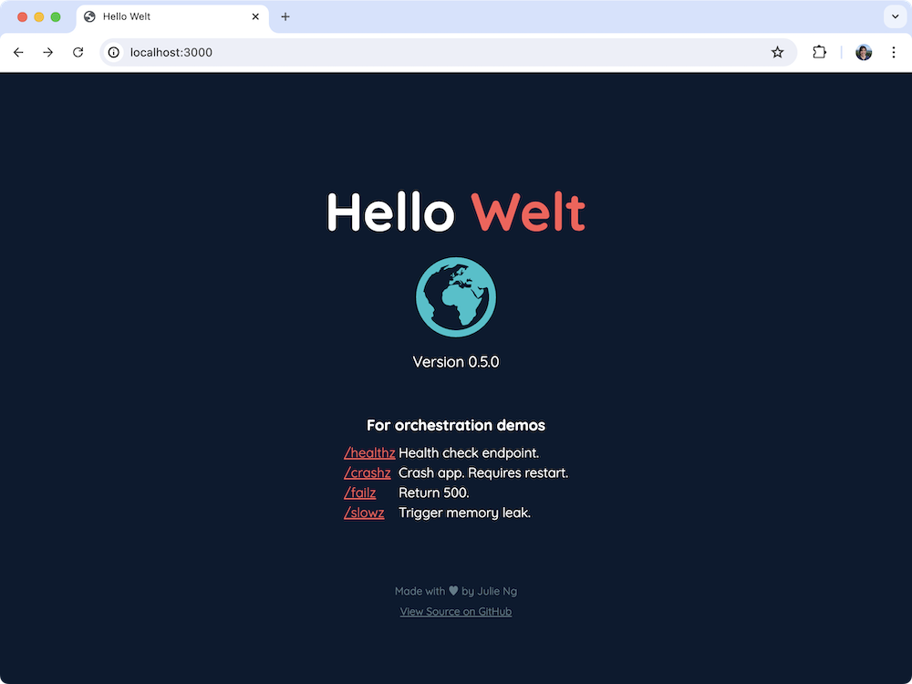

# hello-welt

Simple Hello World [Fastify app](https://www.fastify.io/) for demos.



_Earth icon by iconmonstr.com_

## Configuration

The following variables can be configured

| Environment Variable | Default |
|:--|:--|
| `VERSION` | Version from `package.json` |
| `HELLO_GREETING` | Hello |
| `HELLO_NAME` | Welt |
| `HELLO_COLOR` | #ff5757 |
| `EARTH_COLOR` | #57ffd1 |
| `PORT` | 3000 |
| `HOST` | `localhost` in development and `0.0.0.0` in production |

## Usage

Install dependencies 

```bash
npm install
```

Start the app

```bash
npm start
```

and then open [http://localhost:3000](http://localhost:3000) in your browser.

### Local Development

For local development, we will use [pino-pretty](https://github.com/pinojs/pino-pretty) to format logs with color

```
npm install -g pino-pretty
```

We also also use [nodemon](https://nodemon.io/) to automatically restart the app when code changes. Use the `dev` command to put everything together

```
npm run dev
```

which is a shortcut for

```
NODE_ENV=development nodemon -w app app/app.js | pino-pretty
```

### Docker

Pull the [julieio/hello](https://hub.docker.com/repository/docker/julieio/hello) public image from Docker Hub and then run it:

```
docker pull julieio/hello:latest
docker run -p 3000:3000 julieio/hello:latest
```

Optionally - pass configuration via environment variables:

```
docker run -p 3000:3000 -e HELLO_NAME=Julie julieio/hello:latest
```

or build from scratch

```
docker build . -t hello-welt
docker run -p 3000:3000 hello-welt
```

## References

- [Heroku Blog: Let It Crash: Best Practices for Handling Node.js Errors on Shutdown](https://blog.heroku.com/best-practices-nodejs-errors) by Julián Duque
- [Snyk Blog: 10 best practices to containerize Node.js web applications with Docker](https://snyk.io/blog/10-best-practices-to-containerize-nodejs-web-applications-with-docker/) by 
Liran Tal and Yoni Goldberg